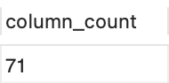
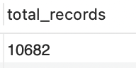
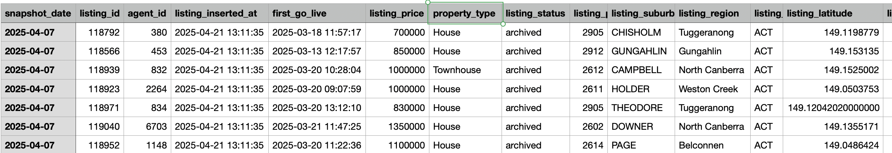
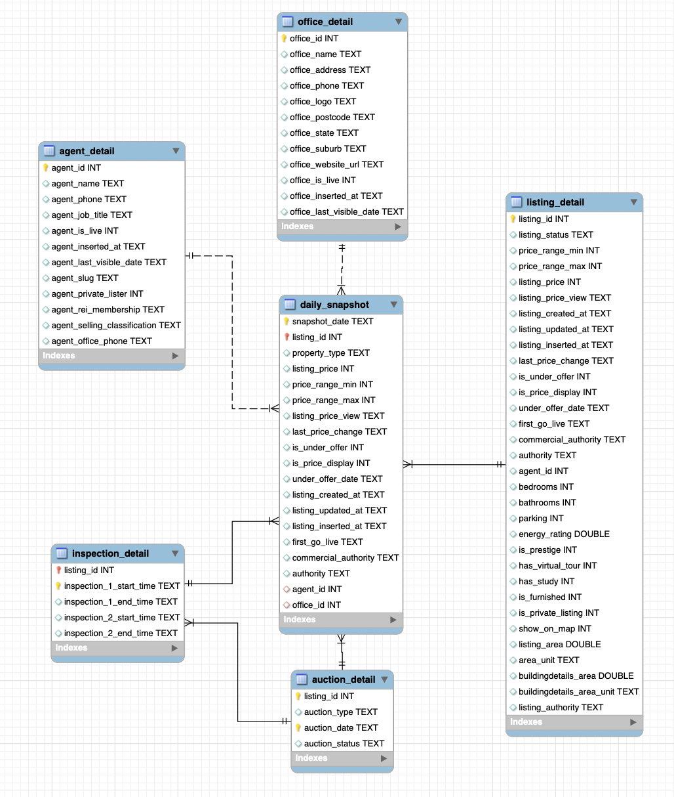
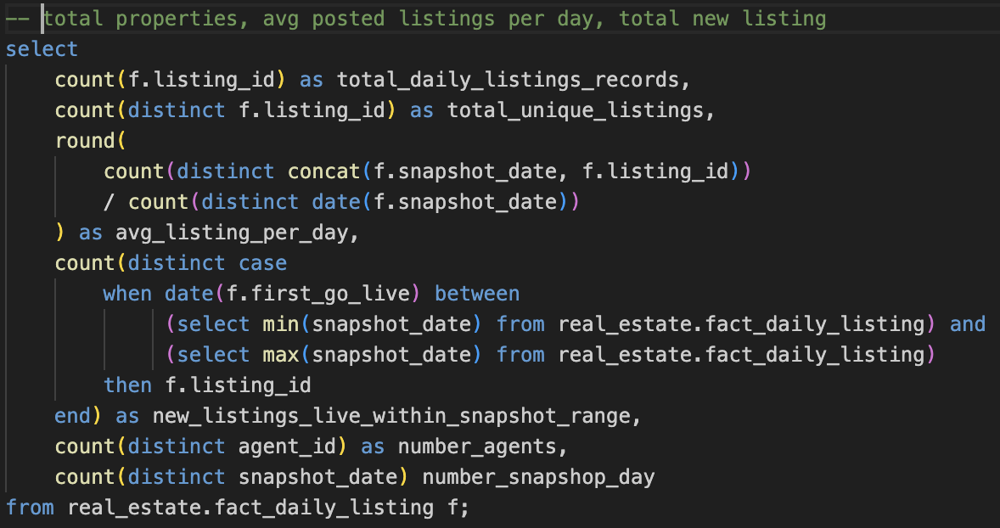
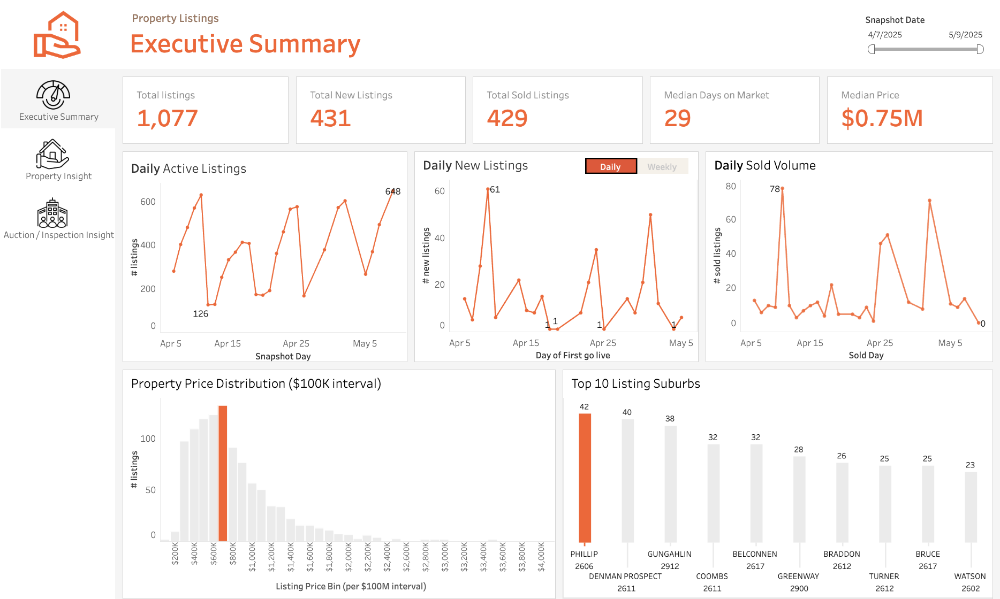
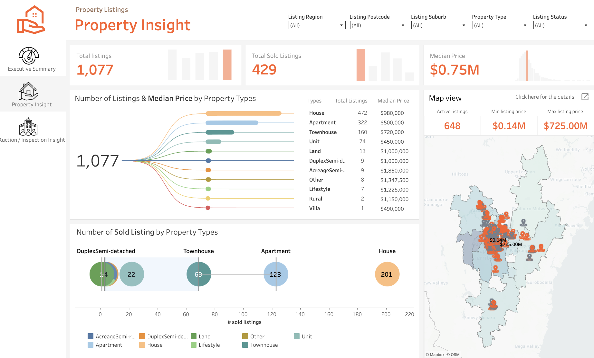
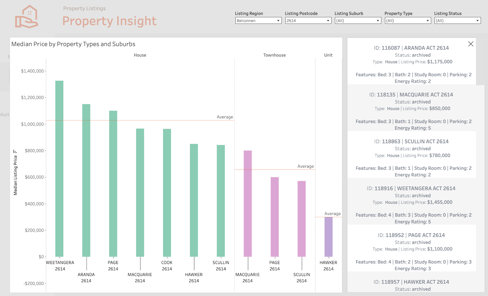
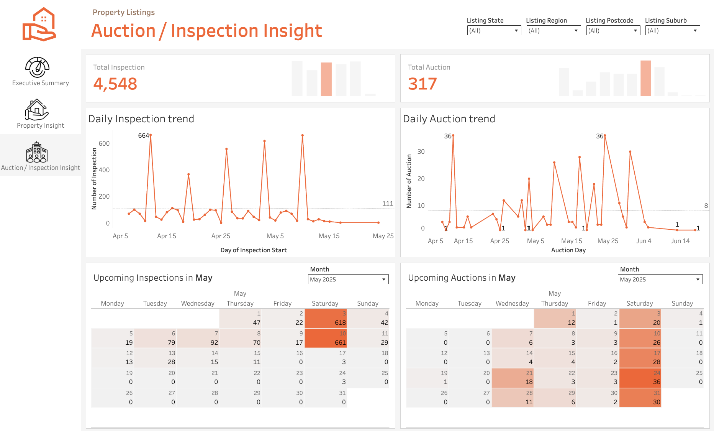

## 🏘️ Real Estate Listings Project (1 Month Data)

This project dives into real-world property listings, taking raw, messy data and transforming it into structured insights using SQL and Tableau. More than just a technical exercise, it's a reflection of how data — when shaped the right way — can tell powerful stories about markets, people, and places.

---

## 🛠️ Tools & Techniques

**MySQL**, **Tableau**, **Data Analysis**, **Data Modeling**, **Data Visualization**

---

## 📥 Data Collection & Overview

* Collected snapshot data from real estate listings
* Transformed it into clean, analysis-ready models using SQL
* Built for real-world data training and practice

[Raw data can be found here](./raw_tbl.csv)

The dataset includes: **71 columns** and **10,682 records**

Raw data overview

---

## 🧱 Data Modeling Approach

I created SQL queries to split the data into:

* **Fact tables** — transactional data that changes over time (e.g. listings)
* **Dimension tables** — descriptive fields that add context (e.g. agents, suburbs)

This structure follows best practices for scalable, reliable analytics.

![alt text]

[SQL quote can be found here](./real_estate_data_model.sql)

---

## 🔍 SQL-Based Data Exploration

Once modeled, I used SQL to dive deep into the data using:

* `SELECT`, `FROM`, `WHERE`, `GROUP BY`, `HAVING`
* `LEFT JOIN`, subqueries, window functions, basic calculations

Insights explored:

* Total number of properties
* Average daily listings
* New vs. sold listings
* Top 5 most active agents
* Median listing price
* Number of inspections before sale
* Inspection conversion rate
* Median sale price & time on market by property type
* Fastest-selling homes
* Listings with price changes over time

Example SQL syntax:

[SQL code can be found here](./propertylistingsEDA.sql)

---

## 📊 Dashboard Highlights

Using Tableau, I created a dashboard with 3 interactive tabs:

1. **Executive Summary** – Listings trends and key KPIs
2. **Property Insights** – Price comparisons by location and hotspot areas
3. **Auction & Inspection** – Calendar view of market activity

🔗 [LinkedIn dashboard post](https://www.linkedin.com/feed/update/urn:li:activity:7339201532086689795/)

🔗 [View on Tableau Public](https://public.tableau.com/app/profile/tien.le2550/viz/real_estate_dashboard_17476316458810_17490860210760/DashboardKPI)

---

## 📌 Key Insights

### 🔄 Balanced Market Activity

Out of 1,077 listings, **429 were new** and **432 were sold**, showing a well-aligned supply and demand dynamic.

### ⏳ 29 Days to Sell

Most properties were sold within **29 days** — a valuable benchmark for turnover expectations.

### 🏡 Market Dominated by Houses

Houses led in volume, followed by apartments and townhouses — together making up **88% of listings** and **91% of sales**.

### 🔍 Buyer Behavior from Inspections

Most listings had **1–2 inspections**, peaking on weekends. One standout property had **10 inspections**, pointing to either high interest or slower conversion.

### 🔨 Private Treaty Over Auctions

Only **8%** of inspections were linked to auctions — confirming **private treaty** as the dominant method in this market.

---

## 🚀 Final Thoughts

This project reminded me that data isn’t just numbers — it’s movement, intention, and behavior captured in rows and columns. Turning this raw dataset into insights was both a technical challenge and a creative process.

From modeling to visualization, every step helped sharpen my ability to think like a data professional — and tell a story with the numbers.

If you're curious to dive deeper, feel free to explore the SQL code, check out the dashboard, or connect with me.

📬 [Let’s connect on LinkedIn](https://www.linkedin.com/in/aimeele97/)