# 📊 Data Analyst Job Postings in Australia (25 April – 26 June)

> **Tools:** Snowflake, SQL, Tableau  
> **Techniques:** Data Analysis, Data Modeling, Data Visualization  
> **Source code:** [`SQL modeling`](data_modeling.sql), [`SQL analysis`](data_analysis.sql)  
> **Dashboard:** [Tableau Public](https://public.tableau.com/app/profile/tien.le2550/viz/Book1_17460849868290_17513811269990/Dashboardoverview) 

---

## 🎯 1. Quick Overview of Findings

This project explores job posting trends for **Data Analyst** roles in Australia over a two-month period. Using data scraped from SEEK, we processed, modeled, and visualized insights to understand demand, timing, location patterns, and hiring behavior.

> **Project Name:** Data Analyst Job Trends Australia  
> **Data Sources:** [`seek_raw_data.csv`](seek_data_snowflake_no_header.csv)  
> **Tools Used:** Python, SQL, Tableau, Excel  

### 🔍 Key Findings:
- **Information & communication technology** is the top industry hiring analysts
- **NSW & VIC** dominate analyst job opportunities
- **Most jobs** remain live for only **1 to 4 days**
- **Tuesdays** are the best day to apply or post
- Very few roles are mentioned level in the job title, around 95% of unspecified which level tare hiring

   

---

## 🌐 2. Sources of Data

| Index | Name       | Source       | Summary                         | Data Format |
|-------|------------|--------------|----------------------------------|-------------|
| 1     | seek raw data  | Seek.com.au | Web scraping - Data Analyst job listings (AU)   | CSV         |


Column definition:
| Column Name                   | Description                                             |
| ----------------------------- | ------------------------------------------------------- |
| `snapshot_date`               | Date when the data snapshot was taken                   |
| `page`                        | Page number on which the job listing was found          |
| `job_id`                      | Unique identifier for the job listing                   |
| `job_title`                   | Title of the job                                        |
| `job_subtitle`                | Subtitle or secondary job description                   |
| `advertiser_id`               | Unique identifier for the advertiser/employer           |
| `advertiser_name`             | Name of the advertiser/employer                         |
| `listing_date`                | Date the job was listed                                 |
| `posted_ago`                  | Time since the job was posted (e.g., "3 days ago")      |
| `promoted_flag`               | Indicator if the job was marked as promoted             |
| `is_promoted`                 | Boolean flag for promotion status                       |
| `job_teaser`                  | Teaser or brief job description                         |
| `job_classification_slug`     | URL-friendly string representing the job classification |
| `job_processing_code`         | Internal processing code for the job                    |
| `advertiser_logo_url`         | URL to the advertiser’s logo                            |
| `job_type`                    | Type of job (e.g., Full-time, Part-time)                |
| `work_location_type`          | Location type (e.g., Remote, On-site)                   |
| `job_salary`                  | Salary information (likely free-text)                   |
| `job_benefits`                | Listed benefits of the job                              |
| `job_highlight_1`             | Key highlight or selling point #1                       |
| `job_highlight_2`             | Key highlight or selling point #2                       |
| `primary_classification_id`   | ID for the main job classification                      |
| `primary_classification_name` | Name of the main job classification                     |
| `subclassification_id`        | ID of the job subclassification                         |
| `subclassification_name`      | Name of the job subclassification                       |
| `location_name`               | Name of the job location                                |
| `country_code`                | Country code (e.g., AU, NZ)                             |
| `location_postcode`           | Postal code of the job location                         |
| `location_region`             | Region or state of the job                              |
| `job_guid`                    | Global Unique Identifier for the job                    |
| `job_url_suffix`              | URL suffix to the job details page                      |
| `job_listing_type`            | Type of listing (e.g., organic, paid)                   |
| `listing_source`              | Source platform or method used to gather the listing    |
| `industry_id`                 | ID of the industry                                      |
| `scraper_user`                | User or process that scraped the job data               |
| `is_expired_flag`             | Boolean flag indicating if the job listing is expired   |

---

### ⚙️ Getting the Data

#### Step 1: Data Cleaning
- Uploaded cleaned CSV to **Snowflake**
- Checked and removed duplicate record
- Rename the column

#### Step 2: Data Modeling
- Used SQL to create fact and dimension table to model the data

Source code example:
```sql
  -- ========== 1. DIM_ADVERTISER ==========
  CREATE OR REPLACE TABLE SEEK_DATA.PUBLIC.DIM_ADVERTISER (
      advertiser_id STRING PRIMARY KEY,
      advertiser_name STRING,
      advertiser_logo_url	STRING
  );

  INSERT INTO SEEK_DATA.PUBLIC.DIM_ADVERTISER (advertiser_id, 
       advertiser_name, advertiser_logo_url)
  SELECT DISTINCT advertiser_id, advertiser_name, advertiser_logo_url
  FROM SEEK_DATA.PUBLIC.SEEK_RAW_DATA
  WHERE advertiser_id IS NOT NULL;
```

---

## 📚 Assumptions

- Data was scraped from **only 10 pages per run**, so not all postings were captured during the period.
- Role levels are classified based on title keyword matches.

---

## 📊 Summary Visuals & Insights

### 📌 General Summary
* **Total postings**: 8,140  
* **Unique companies**: 2,051  
* **Locations**: 543 across Australia  
* **Keyword**: “data analyst”

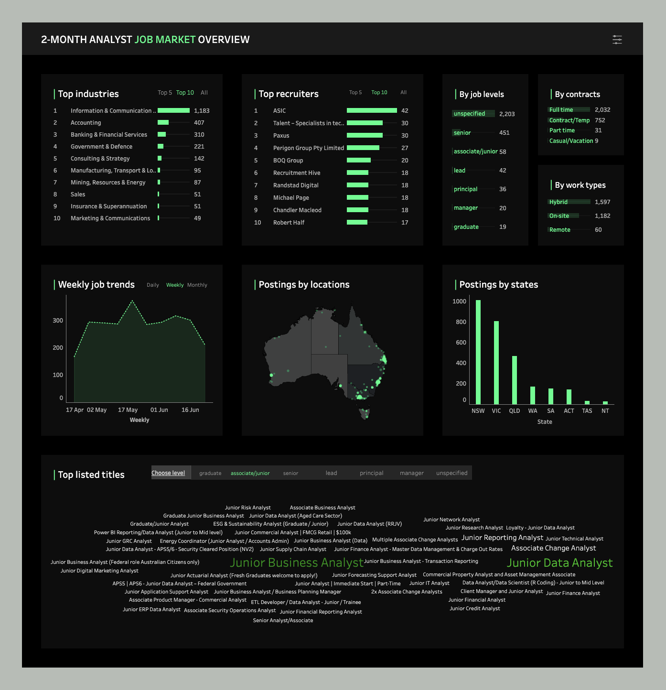

---

### 📈 Analyst-Specific Job Titles

* **Avg. analyst job postings/day**: 42  
* **Total analyst-specific jobs**: 2,829

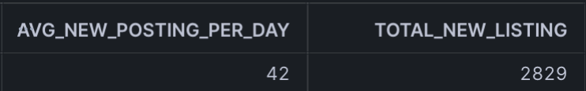

---

### ⏳ Posting Duration

* Most postings last **1–4 days**
* Longest listing: **29 days**


---

### 📅 Weekly & Daily Trends

* Higher activity seen in **May–June**

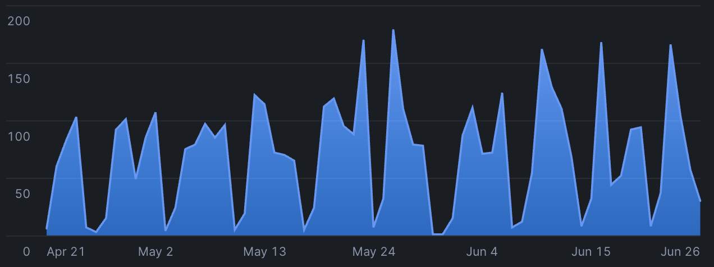

---

### 👥 Role Levels

* **Junior**: 2.05%  
* **Senior**: 16.28%  
* **Other**: 81.67%


---

### 🧾 Advertiser Insights

* **70%** of advertisers posted only **1 job**  
* Most active advertiser posted **26 jobs**

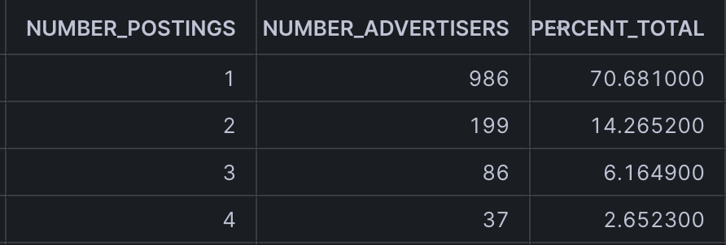  
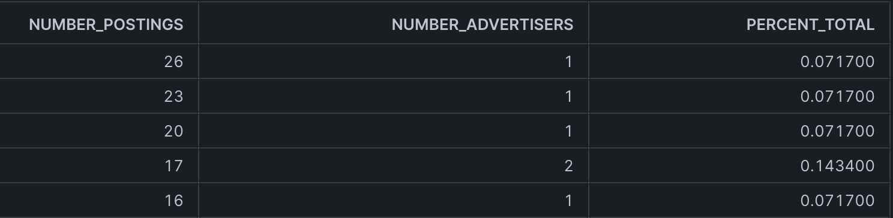

---

### 🚀 Promotions

* **7%** of jobs were marked as **promoted**


---

### 🏢 Top Hiring Companies


---

### 🗺️ State & Region Breakdown

* **NSW + VIC = 60%+** of postings

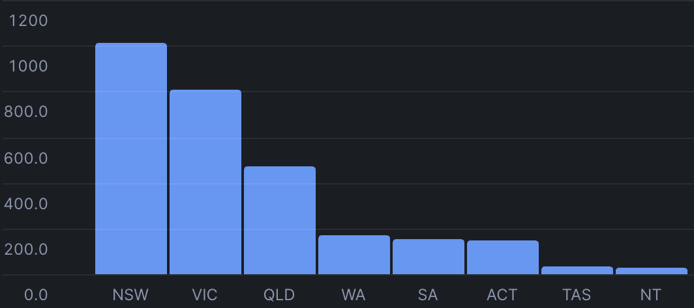  
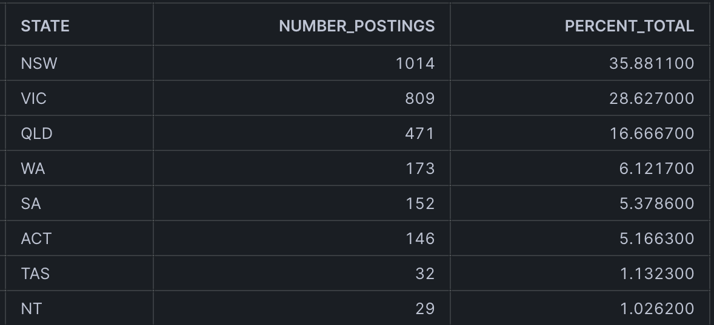  
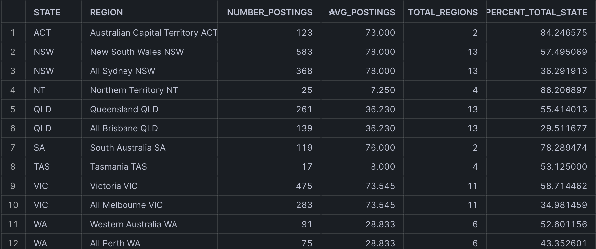

---

### 📆 Daily New Postings

* **Average/day**: 42  
* **Total (snapshot period)**: 2,675  
* **Most active day**: **Tuesday**

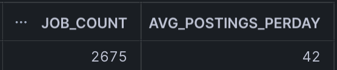  
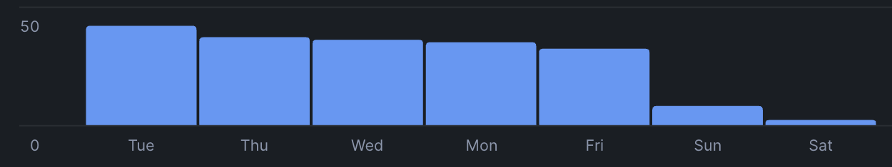  
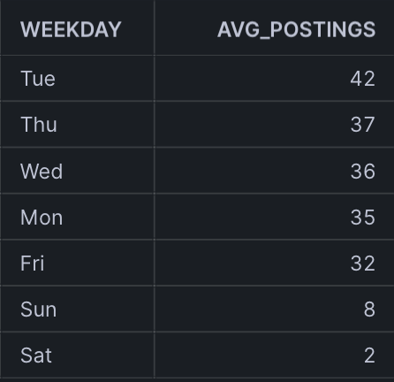

---

### 🏭 Top Industries Hiring Analysts

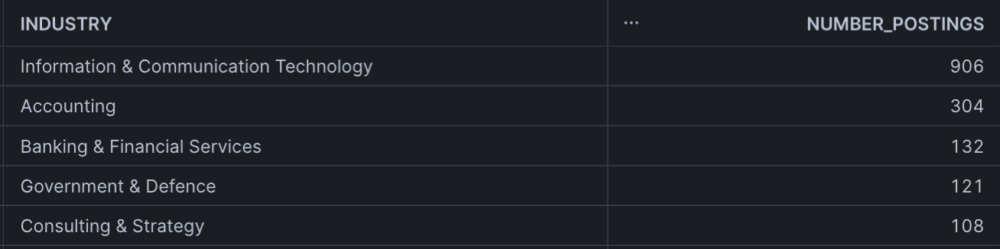

---

## 📌 Recommendations Based on Insights

Hiring Copany 
### 1. Post Jobs Early in the Week  
Tuesdays see the most new postings — both recruiters and job seekers should act accordingly.

### 2. ⚠️ Optimize for Short Lifespan  
Jobs typically stay up only 3 days. Job seekers need alerts; recruiters may consider promoting or reposting mid-week.

### 3. 📍 Prioritize NSW & VIC  
These two states offer the majority of roles. Candidates should focus here unless searching for remote roles.

### 4. 📆 Align Hiring with Seasonal Peaks  
May–June sees a hiring boost — great time to apply or post.

### 5. 🎓 Address the Junior Role Gap  
Only ~2% of jobs target junior talent. Graduates should focus on internships or skill-building, and companies should invest in entry-level roles.

### 6. 🔍 Target Top Hiring Companies  
Some companies hire at higher volumes — great targets for job seekers.

### 7. 📣 Promote Listings When Urgent  
Only 7% of jobs are promoted, so standing out is possible with boosted visibility.

---

## ⚠️ Disclaimer

The data used in this project was **collected from publicly available job postings on SEEK** during the specified time period. It reflects **real-world job market conditions** as observed between **25 April – 26 June 2025**.

This project is conducted **solely for educational and non-commercial purposes** to demonstrate data analysis, modeling, and visualization techniques.  


