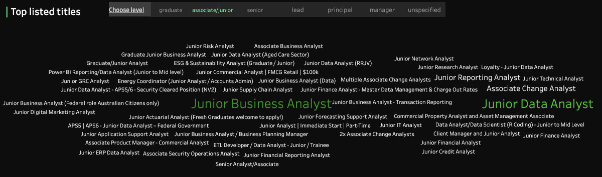
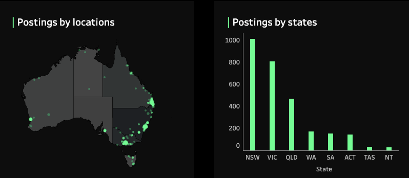
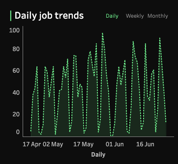
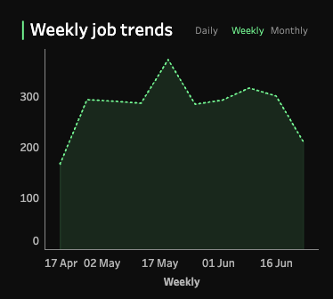

# 📊 2-Month Analyst Job Market Overview (25 April – 26 June)

> **Tools:** Snowflake, SQL, Tableau  
> **Techniques:** Data Analysis, Data Modeling, Data Visualization  
> **Source code:** [`SQL modeling`](data_modeling.sql), [`SQL analysis`](data_analysis.sql)  
> **Dashboard:** [Tableau Public](https://public.tableau.com/app/profile/tien.le2550/viz/Book1_17460849868290_17513811269990/Dashboardoverview) 

---

## 📚 Table of Contents

  - [Quick Overview of Findings](#quick-overview-of-findings)
  - [Source of Data and Limitations](#source-of-data-and-limitations)
      - [Process](#process)
      - [Limitations](#limitations)
  - [Transfroming the data](#transfroming-the-data)
      - [Step 1: Data Cleaning](#step-1-data-cleaning)
      - [Step 2: Data Modeling](#step-2-data-modeling)
  - [Key Insights](#key-insights)
      - [**Top Hiring Industry: Information & Technology**](#top-hiring-industry-information--technology)
      - [**Most Common Analyst Roles**](#most-common-analyst-roles)
      - [**Top Hiring Locations**](#top-hiring-locations)
      - [**Analyst Job Features**](#analyst-job-features)
      - [**Peak Posting Period**](#peak-posting-period)
      - [**Top Hiring Organization: ASIC**](#top-hiring-organization-asic)
  - [Recommendations](#recommendations-based-on-the-analysis-and-my-own-experiences)
  - [Final Note](#final-note)

---
## Quick Overview of Findings

This project analyzes Analyst job postings across Australia over a 2-month period. It highlights hiring patterns, industry demand, job types, and employer trends. These insights are designed to support job seekers, career advisors, recruiters, and policy makers in navigating the current employment landscape.

### 🔍 Key Findings:
* **Information & Technology** is the leading industry hiring Analyst roles.
* **Data Analyst** and **Business Analyst** are the most common roles.
* **Sydney** leads in job volume, followed by **Melbourne**.
* **Most postings did not specify a job level**; however, among those that did, the majority of analyst roles required a senior level.
* Most roles are **full-time** and offer **hybrid** work arrangements.

    

## Source of Data and Limitations

**Job posting data** was scraped from **[Seek.com](https://www.seek.com.au/)**, one of Australia’s largest job platforms.

### Process

* The dataset was collected over a **2-month period**, focusing on roles containing the keyword **“Analyst.”**
* Data was extracted using custom scripts that pulled job listings from the **first 10 pages** of search results at each scraping interval.

### Limitations

* **Partial Market Coverage**: Because only the first 10 pages were scraped per session, the dataset may **exclude listings** beyond that range — especially during high-volume weeks.  


* **Misleading keywords**: Seek.com’s keyword-based search can surface jobs that **do not have "Analyst" in the job title**, but include the term in the job description.  
  --> To maintain scope and relevance, these **non-Analyst-titled roles were filtered out for visualization**.
  

**Column definition:**
| Column Name                   | Description                                             |
| ----------------------------- | ------------------------------------------------------- |
| `snapshot_date`               | Date when the data snapshot was taken                   |
| `page`                        | Page number on which the job listing was found          |
| `job_id`                      | Unique identifier for the job listing                   |
| `job_title`                   | Title of the job                                        |
| `job_subtitle`                | Subtitle or secondary job description                   |
| `advertiser_id`               | Unique identifier for the advertiser/employer           |
| `advertiser_name`             | Name of the advertiser/employer                         |
| `listing_date`                | Date the job was listed                                 |
| `posted_ago`                  | Time since the job was posted (e.g., "3 days ago")      |
| `promoted_flag`               | Indicator if the job was marked as promoted             |
| `is_promoted`                 | Boolean flag for promotion status                       |
| `job_teaser`                  | Teaser or brief job description                         |
| `job_classification_slug`     | URL-friendly string representing the job classification |
| `job_processing_code`         | Internal processing code for the job                    |
| `advertiser_logo_url`         | URL to the advertiser’s logo                            |
| `job_type`                    | Type of job (e.g., Full-time, Part-time)                |
| `work_location_type`          | Location type (e.g., Remote, On-site)                   |
| `job_salary`                  | Salary information (likely free-text)                   |
| `job_benefits`                | Listed benefits of the job                              |
| `job_highlight_1`             | Key highlight or selling point #1                       |
| `job_highlight_2`             | Key highlight or selling point #2                       |
| `primary_classification_id`   | ID for the main job classification                      |
| `primary_classification_name` | Name of the main job classification                     |
| `subclassification_id`        | ID of the job subclassification                         |
| `subclassification_name`      | Name of the job subclassification                       |
| `location_name`               | Name of the job location                                |
| `country_code`                | Country code (e.g., AU, NZ)                             |
| `location_postcode`           | Postal code of the job location                         |
| `location_region`             | Region or state of the job                              |
| `job_guid`                    | Global Unique Identifier for the job                    |
| `job_url_suffix`              | URL suffix to the job details page                      |
| `job_listing_type`            | Type of listing (e.g., organic, paid)                   |
| `listing_source`              | Source platform or method used to gather the listing    |
| `industry_id`                 | ID of the industry                                      |
| `scraper_user`                | User or process that scraped the job data               |
| `is_expired_flag`             | Boolean flag indicating if the job listing is expired   |

---

## Transfroming the data

### Step 1: Data Cleaning
- Uploaded cleaned CSV to **Snowflake**
- Filtered the job with no **'Analyst'** word in the Title
- Checked and removed duplicate record
- Rename the column

### Step 2: Data Modeling
- Used SQL to create fact and dimension table to model the data

Source code example:
```sql
  -- ========== 1. DIM_ADVERTISER ==========
  CREATE OR REPLACE TABLE SEEK_DATA.PUBLIC.DIM_ADVERTISER (
      advertiser_id STRING PRIMARY KEY,
      advertiser_name STRING,
      advertiser_logo_url	STRING
  );

  INSERT INTO SEEK_DATA.PUBLIC.DIM_ADVERTISER (advertiser_id, 
       advertiser_name, advertiser_logo_url)
  SELECT DISTINCT advertiser_id, advertiser_name, advertiser_logo_url
  FROM SEEK_DATA.PUBLIC.SEEK_RAW_DATA
  WHERE advertiser_id IS NOT NULL;
```

---

## Key Insights

### **Top Hiring Industry: Information & Technology**

* The **Information & Technology** sector posted the highest number of Analyst roles (41.86% of total), reflecting the ongoing demand for digital, data, and system transformation skills, followed by the **Accounting & Banking, Finance industry**, which also shows strong demand for analytical and reporting capabilities.  

  

### **Most Common Analyst Roles**

* The most frequently advertised role titles for all level were:

  * **Data Analyst**
  * **Business Analyst**
* These reflect a dual demand for technical data expertise and business process improvement.

Example Titles for Junior Level:   



### **Top Hiring Locations**

* **NSW (Sydney)** had the highest job posting volume, followed by **VIC (Melbourne)**.
* Most roles were concentrated in urban hubs where large corporates and government agencies are based.

  

### **Analyst Job Features**

* **Seniority Level:** The majority of job postings **did not specify a job level**. However, among those that did, **senior-level positions** were the most frequently indicated.

* **Employment Type:** Most roles were offered as **full-time positions**, with only a small portion listing **part-time** or **casual contracts**.

* **Work Mode:** Unlike many general IT roles that often support remote work, **Analyst positions more commonly require hybrid or on-site presence**. This is an important consideration for candidates pursuing an Analyst career path, particularly those seeking location flexibility.

  

### **Peak Posting Period**

* **Job Posting Trends:** The number of job postings **peaked during the week of 19 May**, largely driven by a spike in listings on **26 May**. However, the **overall volume of postings remained relatively stable week to week**, with no significant fluctuations across the 2-month period.

  

### **Top Hiring Organization: ASIC**

* A total of **1,394 unique advertisers (companies)** posted Analyst roles on Seek.com during the analysis period.
* The highest number of postings from a single employer was **42 jobs**, listed by **The Australian Securities and Investments Commission (ASIC)** — a government agency.
* Several of the other top advertisers were **large recruitment agencies**, which may introduce **bias** into the analysis, as they often post roles across multiple industries or repost similar jobs.
* For more accurate industry-level insights, a **deeper analysis is recommended**, including:

  * **Filtering out major recruitment firms**
  * **Grouping postings by actual hiring organization**, not the advertising agency

This would help avoid inflated counts and provide a clearer view of which industries and employers are truly hiring the most Analysts.

  

---

## Recommendations based on the analysis and my own experiences


**Understand the Employment Environment:** The job environment for Analyst roles in Australia is shaped by a mix of factors, including visa eligibility, work format preferences, and employer expectations. Candidates — especially international ones — need to approach their job search with strategic awareness.


* **Visa & Sponsorship Awareness**:  Although **ASIC** posted the highest number of Analyst roles across Australia, it's important to note that **most government jobs — including those at ASIC — do not accept visa holders**, even if the candidate meets all other criteria such as skills, experience, and full-time availability. This is particularly true for **permanent full-time positions**. Based on prior research, visa holders should be especially cautious when applying to government roles. It’s essential to **research each company’s visa policies**, and always **read job descriptions carefully** to confirm **visa eligibility**. This helps avoid wasted effort and ensures you're targeting roles that align with your employment status.

* **Hybrid & On-Site Expectations**: Unlike many software or engineering roles that offer remote flexibility, **Analyst positions often require hybrid or on-site presence**, especially in finance, consulting, and public sector organizations. Candidates should be prepared for **in-person collaboration**, client-facing duties, or office-based compliance requirements.

* **Job Titles vs. Role Scope**: Due to keyword-based job search platforms like Seek, some roles that are **not truly Analyst positions** may still appear in search results. Job seekers should:

  * **Evaluate job descriptions thoroughly** to confirm alignment with their skills and career goals.
  * Be cautious of roles from **recruitment firms** that reuse the “Analyst” title across unrelated industries.

* **Competitive Market for Entry-Level Roles**: Since most postings **do not specify seniority**, and those that do lean toward **senior-level**, junior candidates must:

  * Look for **graduate programs**, internships, or entry-level roles that explicitly state suitability for early-career applicants.
  * Consider upskilling through **short courses, bootcamps, or certifications** to improve competitiveness.

* **Timing Your Applications**: Although job volume remained stable overall, the spike around **late May** suggests that hiring may align with **budget cycles, project phases**, or **financial year transitions**. Understanding this can help candidates **time applications more effectively**.

---

## Final Note

This basic analysis offers a useful snapshot of Analyst job market trends in Australia. While not exhaustive, it highlights key opportunities and challenges for different types of job seekers, especially in a country where many candidates are international students or temporary workers seeking experience or sponsorship.

A deeper analysis in future could include:

* Salary trends
* Required technical skills
* Application conversion rates
* Keyword-level job description mining
