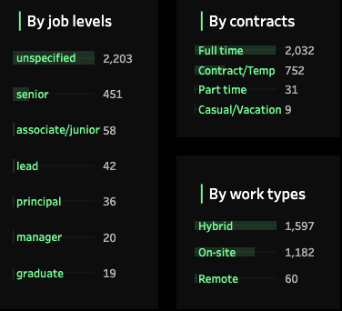
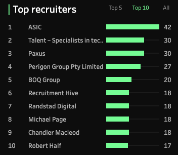
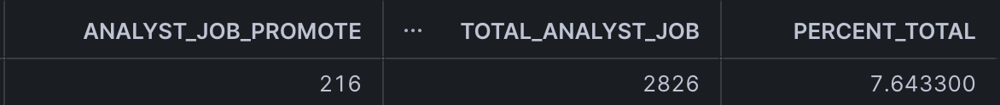

# 📊 Data Analyst Job Postings in Australia (25 April – 26 June)

> **Tools:** Snowflake, SQL, Tableau  
> **Techniques:** Data Analysis, Data Modeling, Data Visualization  
> **Data Period:** 25 April – 26 June 2025

---

## 🎯 1. Quick Overview of Findings

This project explores job posting trends for **Data Analyst** roles in Australia over a two-month period. Using data scraped from SEEK, we processed, modeled, and visualized insights to understand demand, timing, location patterns, and hiring behavior.

> **Project Name:** Data Analyst Job Trends Australia  
> **Data Sources:** [`seek_raw_data.csv`](seek_data_snowflake_no_header.csv)  
> **Tools Used:** Python, SQL, Tableau, Excel  

### 🔍 Key Findings:
- **Information & communication technology** is the top industry hiring analysts
- **NSW & VIC** dominate analyst job opportunities
- **Most jobs** remain live for only **1 to 4 days**
- **Tuesdays** are the best day to apply or post
- Very few roles are mentioned level in the job title, around 95% of unspecified which level tare hiring

---

## 🌐 2. Sources of Data

| Index | Name       | Source       | Summary                         | Data Format |
|-------|------------|--------------|----------------------------------|-------------|
| 1     | SEEK Jobs  | Web scraping | Data Analyst job listings (AU)   | CSV         |

---

### ⚙️ Getting the Data

#### Step 1: Data Cleaning
- Checked and removed duplicate record

#### Step 2: Data Modeling
- Uploaded cleaned CSV to **Snowflake**
- Used SQL to rename, filter, and model the data

---

## 📚 Assumptions

- Data was scraped from **only 10 pages per run**, so not all postings were captured during the period.
- Duplicates and expired jobs may not be fully excluded.
- Role levels are classified based on title keyword matches.

---

## 📊 Summary Visuals & Insights

### 📌 General Summary
* **Total postings**: 8,140  
* **Unique companies**: 2,051  
* **Locations**: 543 across Australia  
* **Keyword**: “data analyst”

---

### 📈 Analyst-Specific Job Titles

* **Avg. analyst job postings/day**: 42  
* **Total analyst-specific jobs**: 2,829

---

### ⏳ Posting Duration

* Most postings last **1–4 days**
* Longest listing: **29 days**

---

### 📅 Weekly & Daily Trends

* Higher activity seen in **May–June**

---

### 👥 Role Levels

* **Junior**: 2.05%  
* **Senior**: 16.28%  
* **Other**: 81.67%

---

### 🧾 Advertiser Insights

* **70%** of advertisers posted only **1 job**  
* Most active advertiser posted **26 jobs**

  

---

### 🚀 Promotions

* **7%** of jobs were marked as **promoted**

---

### 🏢 Top Hiring Companies

---

### 🗺️ State & Region Breakdown

* **NSW + VIC = 60%+** of postings

  
  

---

### 📆 Daily New Postings

* **Average/day**: 42  
* **Total (snapshot period)**: 2,675  
* **Most active day**: **Tuesday**

  
  

---

### 🏭 Top Industries Hiring Analysts

---

## 📌 Recommendations Based on Insights

### 1. 🕒 Post Jobs Early in the Week  
Tuesdays see the most new postings — both recruiters and job seekers should act accordingly.

### 2. ⚠️ Optimize for Short Lifespan  
Jobs typically stay up only 3 days. Job seekers need alerts; recruiters may consider promoting or reposting mid-week.

### 3. 📍 Prioritize NSW & VIC  
These two states offer the majority of roles. Candidates should focus here unless searching for remote roles.

### 4. 📆 Align Hiring with Seasonal Peaks  
May–June sees a hiring boost — great time to apply or post.

### 5. 🎓 Address the Junior Role Gap  
Only ~2% of jobs target junior talent. Graduates should focus on internships or skill-building, and companies should invest in entry-level roles.

### 6. 🔍 Target Top Hiring Companies  
Some companies hire at higher volumes — great targets for job seekers.

### 7. 📣 Promote Listings When Urgent  
Only 7% of jobs are promoted, so standing out is possible with boosted visibility.

---

## ❤️ Acknowledgements

Thanks to:
- **SEEK** for providing publicly available job postings.
- **Snowflake** for cloud data warehousing.
- **Tableau** for interactive visualizations.

## ⚠️ Disclaimer

The data used in this project was **collected from publicly available job postings on SEEK** during the specified time period. It reflects **real-world job market conditions** as observed between **25 April – 26 June 2025**.

This project is conducted **solely for educational and non-commercial purposes** to demonstrate data analysis, modeling, and visualization techniques.  

